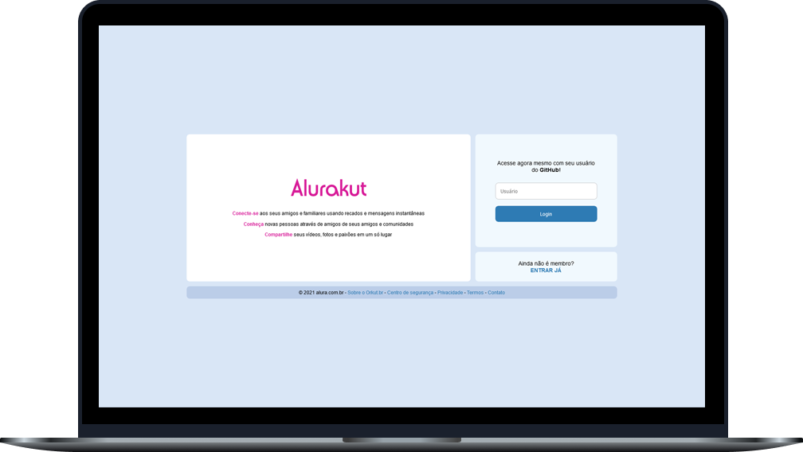
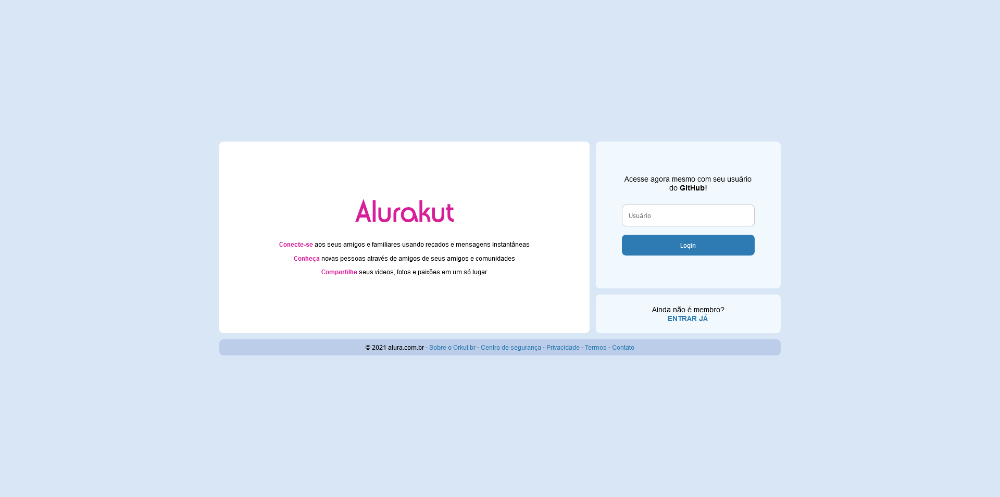
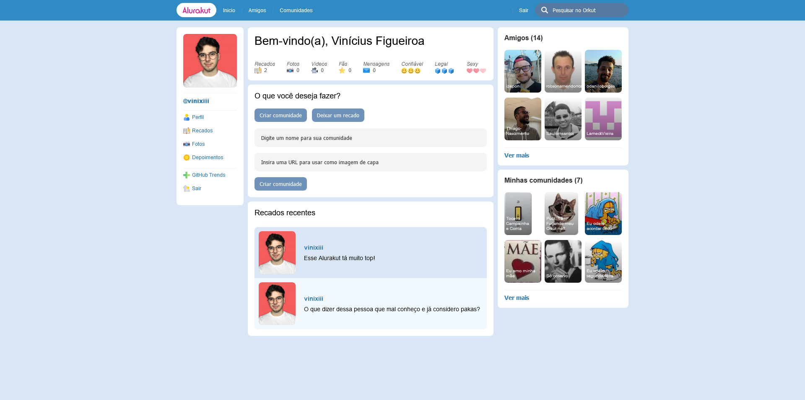
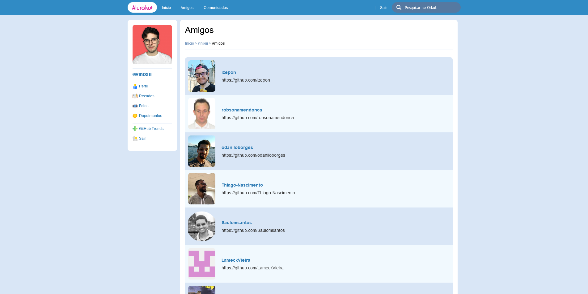
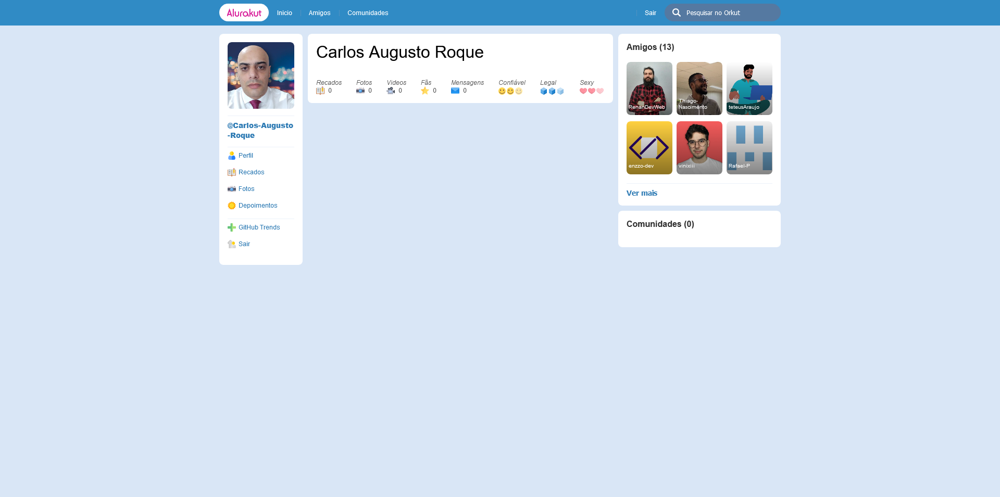
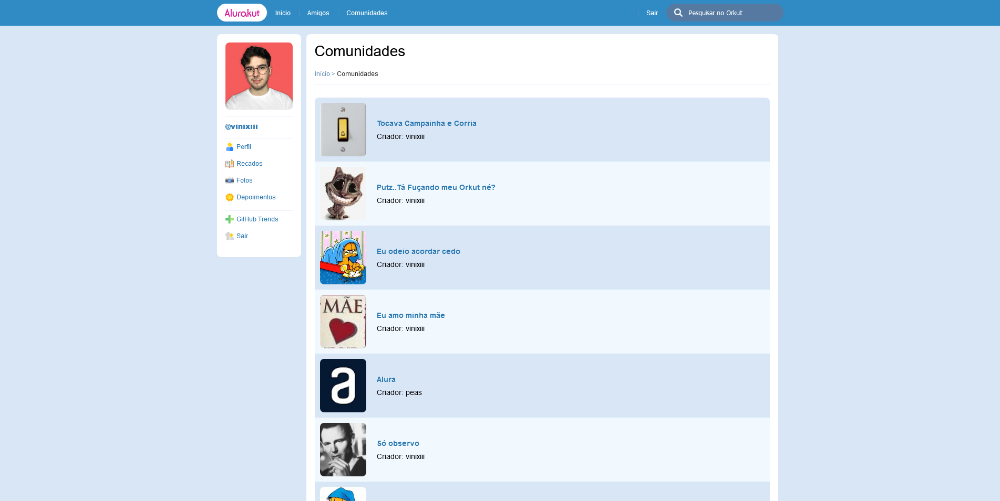
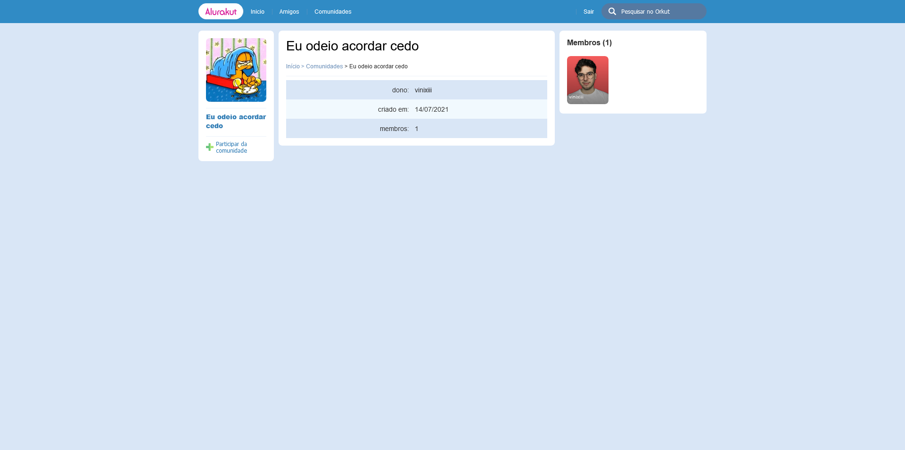
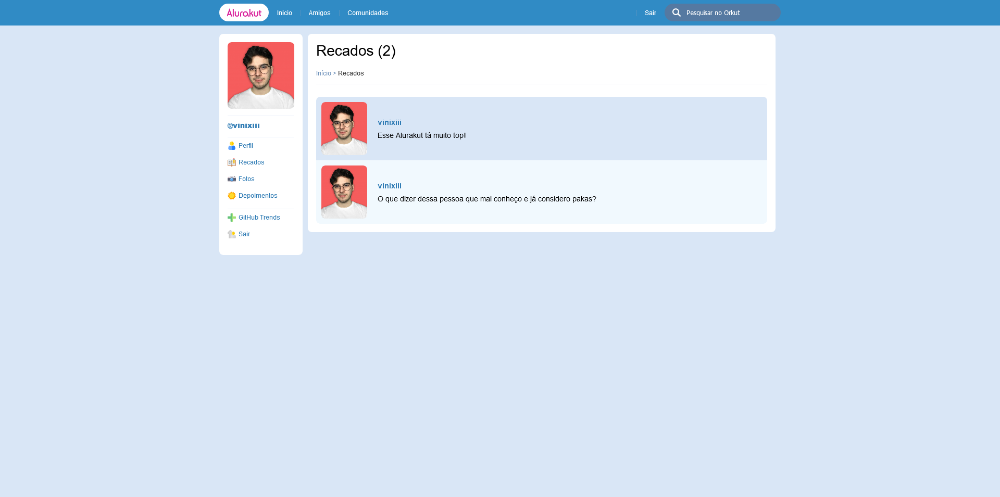

<h1 align="center">
  
</h1>
 
 

  

 

## Sobre o projeto 💬

O **Alurakut** é uma aplicação web clone do nosso queridíssimo e já falecido Orkut, porém trazendo uma interface mais moderna e utilizando as melhores tecnologias de desenvolvimento!

<!-- Ao logar na aplicação com nosso username do GitHub vamos para a página home, nela vemos nossos amigos (seguidores do GitHub), as comunidades que participamos, e os últimos recados deixados. Além disso é possível criar novas comunidades e novos recados! -->

## Páginas 🔖

- [Login](#página-de-login)
- [Perfil](#página-de-perfil)
- [Amigos](#página-de-amigos)
- [Perfil de amigo](#página-de-perfil-de-amigo)
- [Comunidades](#página-de-comunidades)
- [Comunidade](#página-de-comunidade)
- [Recados](#página-de-recados)

## Funcionalidades 🧠

A aplicação contém as seguintes funcionalidades:

### Página de Login

- Fazer login com o username do GitHub.

  

### Página de perfil

- Ver amigos (seguidores do GitHub);
- Ir até o perfil de amigos;
- Ver as comunidades que participa;
- Ir até a página da comunidade;
- Criar uma nova comunidade;
- Ver os recados recentes;
- Deixar novos recados;
- Fazer logout.

  

### Página de amigos

- Ver todos seus amigos (seguidores do GitHub);
- Clicar em um amigo para ir até seu perfil;
- Clicar no link abaixo do username para ir até seu perfil no GitHub.

  

### Página de perfil de amigo

- Ver as informações do amigo, incluindo seus amigos (seguidores do GitHub).
- Ver os amigos do amigo.

  

### Página de comunidades

- Ver todos as comunidades criadas;
- Clicar em uma comunidade para ir até sua página.

  

### Página de comunidade

- Ver informações da comunidade;
- Participar da comunidade.

  

### Página de recados

- Ver todos os recados cadastrados.

  

_Veja o vídeo demonstrativo de todas as funcionalidades [Clique aqui](https://alurakut-vinixii.vercel.app)_

## Como utilizar? 📌

Para utilizar a aplicação em sua máquina é necessário ter os seguintes softwares instalados:

- [Node.js](https://nodejs.org/pt-br/)

Com os software citados acima instalados, basta seguir os seguintes passos para executar a aplicação em sua máquina:

1. **Clonar o projeto**  
   Abra o terminal em uma pasta de sua preferência e cole o seguinte código: 
   
   _`git clone https://github.com/vinixiii/alurakut`_

2. **Instalar as depêndencias**  
   Dentro do diretório do projeto, abra o terminal e cole o código: 
   
   _`npm install`_ ou _`yarn`_

_Ou acesse o **Alurakut** no seu navegador! [Clique aqui](https://alurakut-vinixiii.vercel.app)_

## Tecnologias 🛠

Desenvolvido utilizando as seguintes tecnologias:

- [React](https://reactjs.org)
- [Next.js](https://nextjs.org/)
- [DatoCMS](https://www.datocms.com/)
- [React-Toastify](https://www.npmjs.com/package/react-toastify)

---

Feito com ❤ por: Vinícius Figueiroa 🙋🏻‍♂️

